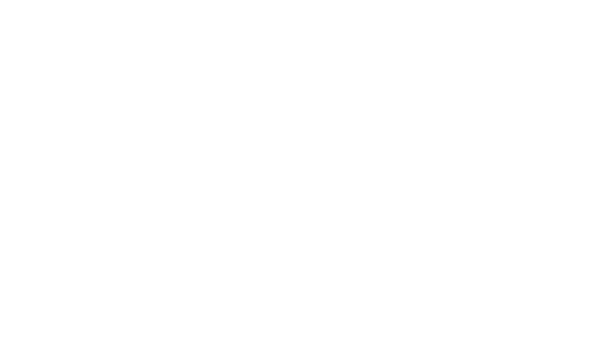

# VOLPIC

VOLPIC, or "Verification Of Lifted Pascal In Coq," is a platform for lifting 
[FPC](https://www.freepascal.org/)-compatible Pascal code into equivalent 
[Gallina](https://coq.inria.fr/doc/v8.9/refman/language/gallina-specification-language.html)
code, which can then be verified in the [Coq Proof Assistant](https://coq.inria.fr/) 
and [extracted](https://coq.inria.fr/doc/v8.9/refman/addendum/extraction.html)
into OCaml or Haskell code.
